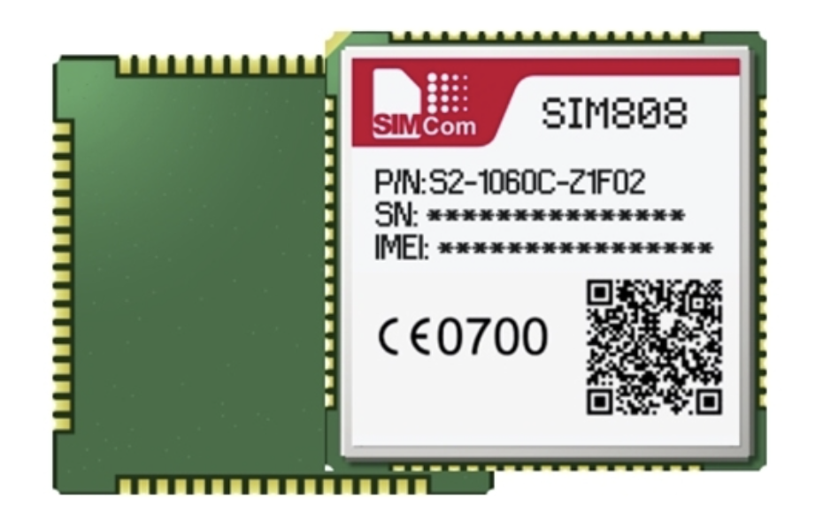

# sim808

Driver for SIM808 cellular module




## Layout

```text
.
├── data                # Assets
├── include             # Core library headers
├── src                 # Core library sources
├── tests               # Unit tests for core library
└── tools               # Tools
    └── CommandLineTool # Command-line tool for testing the driver
```

## Prerequisites

- C++ compiler with `C++20` support
- CMake
- [non-Boost asio](https://think-async.com/Asio/)
- GTest (for unit tests only)

## Build

To build the driver, go to the project root directory and execute the
following commands:

```shell
# Prepare the build system
cmake -DCMAKE_BUILD_TYPE=Debug \
      -DCMAKE_CXX_FLAGS="-std=c++20" \
      -S . -B build/debug

# Build
cmake --build build/debug --target Sim808
```

### Targets

| Name                           |           Description            | Since |
|:-------------------------------|:--------------------------------:|:-----:|
| `Sim808`                       |              Driver              | 0.1.0 |
| `Sim808.Tests`                 |    Unit tests for the driver     | 0.1.0 |
| `Sim808.CommandLineTool.Core`  |  Command-line tool core library  | 0.1.0 |
| `Sim808.CommandLineTool`       |        Command-line tool         | 0.1.0 |
| `Sim808.CommandLineTool.Tests` | Unit tests for command-line tool | 0.1.0 |

### Options

| Name                 |                    Description                     | Default | Since |
|:---------------------|:--------------------------------------------------:|:-------:|:-----:|
| `SIM808_BUILD_TESTS` |      Generates a build target for unit tests       |  `OFF`  | 0.1.0 |
| `SIM808_BUILD_CLT`   | Generates a build target for the command-line tool |  `OFF`  | 0.1.0 |

## Features

- [Short Message Service](include/Sim808/ShortMessages/Service.hpp) (SMS)
  - Retrieving a list of messages from the specified message storage
  - Sending messages
  - Deleting messages (by index and from the specified message storage)

## Command-line tool

An auxiliary tool implemented for testing purposes that allows you to test driver
functionality from a command line.

Commands have the following syntax: `<command> [<parameter> = "..."[, ...]]`. There
are no spaces before and after the `=` sign (added to the top to avoid ambiguity for
fonts with ligatures).

**Example:**

```shell
sms:send to="+7xxxxxxxxxx" text="Hi!"
```

### Short Message Service (SMS)

|   Command    |      Description       |     Parameters      | Since |
|:------------:|:----------------------:|:-------------------:|:-----:|
|  `sms:list`  | Get a list of messages |        None         | 0.1.0 |
|  `sms:send`  |     Send a message     |    `to`, `text`     | 0.1.0 |
| `sms:delete` |    Delete messages     | `index`, `del_type` | 0.1.0 |

_See below for more information about the commands._

**Parameters:**

- `to` - receiver number
- `text` - message text
- `index` - message index
- `del_type` - defines which messages should be deleted

#### Command: `sms:delete`

To delete a single message with the specified index:

```shell
sms:delete index="3"
```

To delete messages from the specified message storage:

```shell
sms:delete del_type="<type>"
```

, where _type_ takes one of the following values:

- `read` - delete only read messages
- `unread` - delete only unread messages
- `sent` - delete only sent messages
- `unsent` - delete only unsent messages
- `inbox` - delete read and unread messages
- `all` - delete all messages

## Documentation

To generate docs, go to the project root directory and execute the following
command:

```shell
doxygen Doxyfile
```

Click [this](docs/html/index.html) to open index page.

## Author

Oleg E. Vorobiov <isnullxbh@gmail.com>

## License

This project is distributed under the MIT License. See [LICENSE](LICENSE) for more information.
